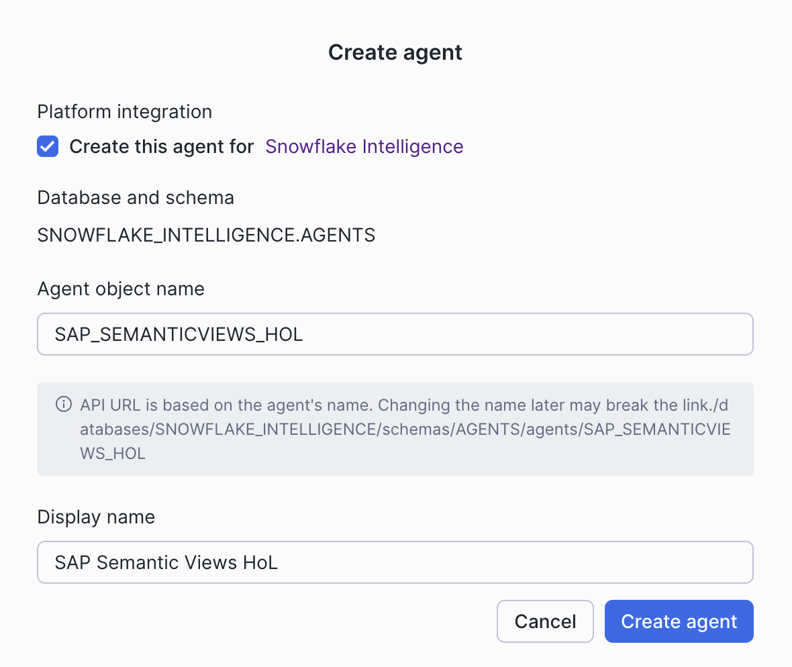
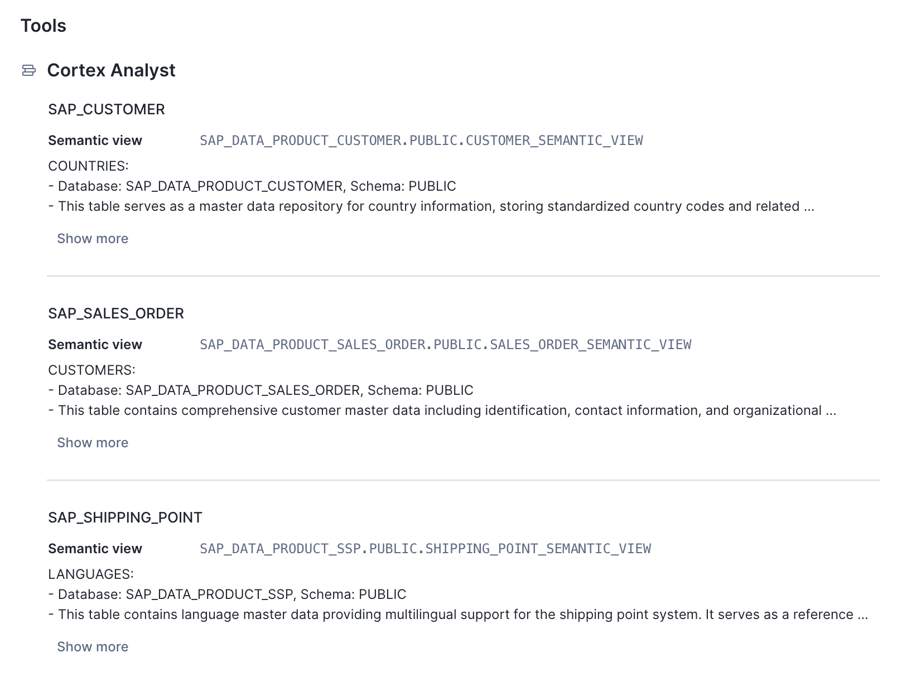
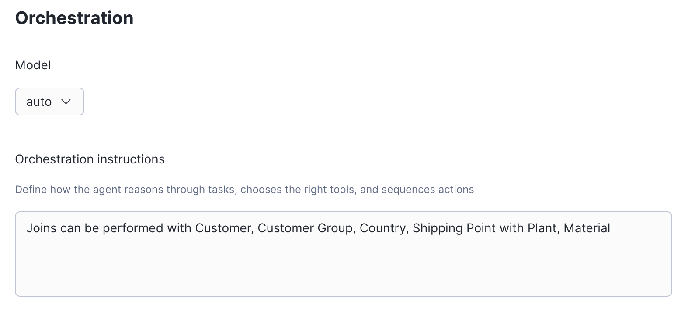

# SAP SEMANTIC VIEWS HOL

1. Copy/Past and run all these in a Snowflake Worksheet. This will setup the git connection, fetch the repository
and will run the 3 sql script to setup the databases.

```sql

CREATE or replace DATABASE SAP_SEMANTIC_VIEWS_HOL;

CREATE OR REPLACE API INTEGRATION API_GITHUB_REPO_SAP_SEMANTIC_VIEWS
  API_PROVIDER = git_https_api
  API_ALLOWED_PREFIXES = ('https://github.com/sfc-gh-fgampfer/')
  ENABLED = TRUE;

CREATE OR REPLACE GIT REPOSITORY GITHUB_REPO_SAP_SEMANTIC_VIEWS
    api_integration = API_GITHUB_REPO_SAP_SEMANTIC_VIEWS
    origin = 'https://github.com/sfc-gh-fgampfer/sap_semantic_views';

-- Make sure we get the latest files
ALTER GIT REPOSITORY GITHUB_REPO_SAP_SEMANTIC_VIEWS FETCH;

-- enable cross-region inference if you wish to use a model which is not available in your region
ALTER ACCOUNT SET CORTEX_ENABLED_CROSS_REGION = 'ANY_REGION';

-- Create DBs, load data and create semantic views
EXECUTE IMMEDIATE FROM @SAP_SEMANTIC_VIEWS_HOL.PUBLIC.GITHUB_REPO_SAP_SEMANTIC_VIEWS/branches/main/SAP_DATA_PRODUCTS_COMPLETE_DDL.sql;
EXECUTE IMMEDIATE FROM @SAP_SEMANTIC_VIEWS_HOL.PUBLIC.GITHUB_REPO_SAP_SEMANTIC_VIEWS/branches/main/SAP_DATA_PRODUCTS_COMPLETE_INSERT_SAMPLE_DATA.sql;
EXECUTE IMMEDIATE FROM @SAP_SEMANTIC_VIEWS_HOL.PUBLIC.GITHUB_REPO_SAP_SEMANTIC_VIEWS/branches/main/SAP_DATA_PRODUCTS_COMPLETE_CREATE_SEMANTIC_VIEWS.sql;

```

2. Setup Agent.

Note: in case Snowflake Intelligence was not used before, please follow the steps outlined here initialy: 
https://docs.snowflake.com/user-guide/snowflake-cortex/snowflake-intelligence#set-up-sf-intelligence

In the Snowflake menu open AI & ML --> Agents and create an agent



Configure 3 Cortex Analyst services for the 3 data products respectively



Provide orchestration instructions to inform the agent about joins across multiple data products



3. Test Agent.

Ask questions concerning multiple data products, i.e.:
Please provide the top 10 customers by total sales with detailed customer names and locations

4. (optional) Extend Agent with non-SAP data from the Snowflake Marketplace
